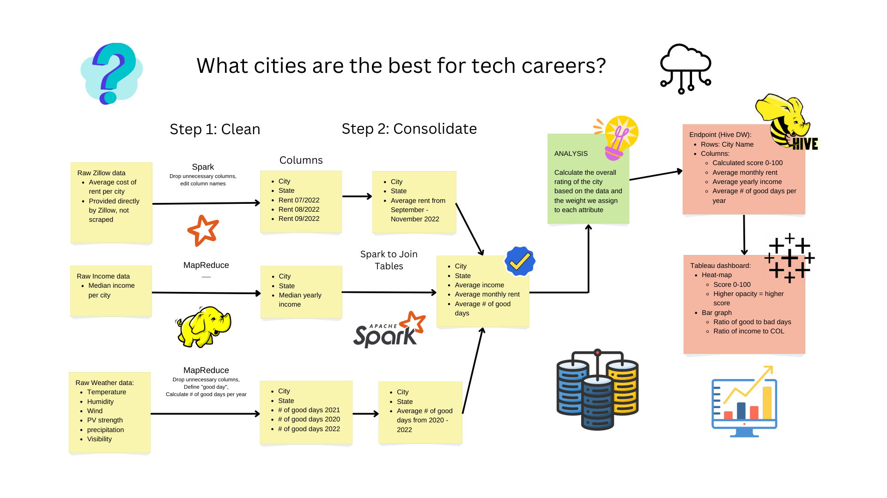

# Top-Towns-To-Take-Over-Tech
Which American cities are the best for tech jobs?

**Jira board link**: <https://big-data-project.atlassian.net/jira/software/projects/BDP/boards/1>
### Directories: (More details found in READMEs of individual directories)
1. ana_code: *I really don't know.*
2. data:
- clean: Contains all of the cleaned datasets just after being cleaned. No other processing has been done yet.
- joined: Contains our fully joined data, which is all of our datasets merged together into one file.
- raw: Contains fully raw data, which we have pulled from multiple sources.
- scored: *We don't have anything here yet oops*
3. data_ingest: *Do we need to put put in here lol?*
4. etl_code: Our code for cleaning all of our data (income/weather/rent) data, and the shell scripts to go along with them. Also included are the commands used to create our hive tables.
5. profiling_code: Our code for averaging the data of multiple years together, as well as the code used to provide scores to cities.
6. screenshots: All the screenshots needed to showcase our analytic in the process of running.
7. test_code: Old code that is not used in the final version of the project, sorted by person. Each subfolder contains old code,shell scripts, and data.

### Running the code:
- *Something about building code that I'm not too clear about right now*
- We have made running the code very simple. All you need to do is go into the first level subdirectories and use the run shell scripts located in each of them.
- All of the input data can be found within the data subdirectory.
