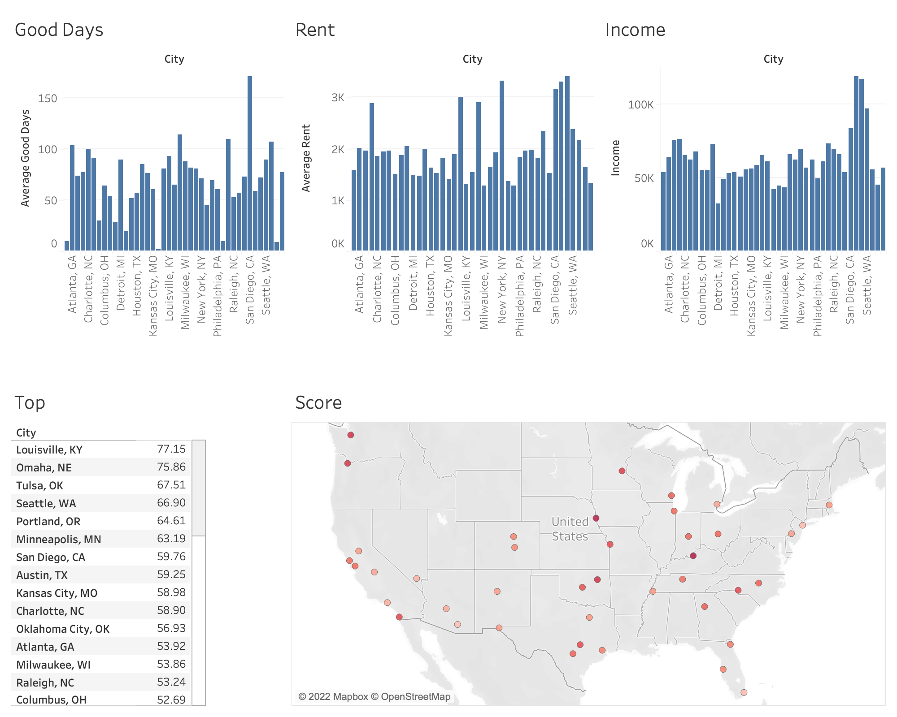

# Top-Towns-To-Take-Over-Tech
Which American cities are the best for tech jobs?

**Jira board link**: <https://big-data-project.atlassian.net/jira/software/projects/BDP/boards/1>

---

## Subdirectories *(Itemized description of each subdirectory)*

1. ana_code: Spark code for anaylsis
    - average the cost of rent from  july-september 2022
    - average ther number of good days from 2020-2022
    - calculate a score from 0-100 for each city

2. data: all data (also stored in HDFS)
    - clean: all of the cleaned datasets just after being cleaned. No other processing has been done yet.
    - joined: fully joined data, which is all of our datasets merged together into one file.
    - raw: fully raw data, which we have pulled from multiple sources.
    - scored: joined data that has been averaged + scored (analysis step)

3. data_ingest: Contains the shell scripts we used to put data into HDFS and provide permissions for Ericsson's (evc252) directory "shared_data". All of the data for the analytic is stored in this shared directory. **Graders and Professor Malavet have access to this directory.**

4. etl_code: MapReduce and Spark code for cleaning the income/weather/rent data, and the shell scripts to go along with them. Also included are the commands used to create our hive tables.
    - ericsson: clean the rent data and merge the different datasets together into our final joined dataset
    - matthew: clean the geographic data, count the number of records in both the income and geographic datasets, and the commands used to input our final scored dataset into Hive (The Hive scripts are not run with the rest of the scripts in the main run script, they must be run separately after logging into beeline/hive)
    - zhiquan: clean and process the weather data

5. profiling_code: code for profiling, such as counting the number of records and checking if the city name columns are in the format of "Cityname, STATE".
    - ericsson: Contains code that checks if the city name columns are in the format of "Cityname, STATE".
    - matthew: Contains code that counts the number of records in the raw income and geographic data. Also contains the queries used to query the hive table in a script. Also contains code that checks if the city name columns are in the format of "Cityname, STATE".
    - zhiquan: Contains code that checks if the city name columns are in the format of "Cityname, STATE".

6. screenshots: screenshots of every step of the analytic, organized by step (data_ingest/profiling/etl/ana)

7. test_code: old code that is not used in the final version of the project, sorted by person. Each subfolder contains old code, shell scripts, and data.
---

## Running the code

We have tried to make running the code as simple as possible by making use of shell scripts. For each step of the analytic, there is an overriding shell script (etl.sh, ana.sh, etc.) that performs all the necessary commands to build and run the underlying MR/Spark programs.

 The exception is the creation and querying of the hive warehouse, which needs to be manually copied into the terminal from the hive_input.sh file in etl_code/matthew and the hive_queries.sh file in profiling_code/matthew
    - The input data can be found at data/scored/hive/hiveData.csv

### To run the analytic

1. Clone this repository in your root folder in peel
2. Go into the respository
3. chmod +x run.sh
4. ./run.sh

sj3549 and adm209 have been granted read, write and execute permissions to:
- the HDFS directory **/user/evc252/shared_data**
- all of the shell scripts

### To find the output of each directory

#### data will be located **both** in HDFS and locally for easy access

- Raw data:
    - HDFS: /user/evc252/shared_data/raw
    - Local: ~/Top-Towns-To-Take-Over-Tech/data/raw

- ETL:
    - Cleaning:
        - HDFS: /user/evc252/shared_data/clean
        - Local: ~/Top-Towns-To-Take-Over-Tech/data/clean

    - Joining:
        - HDFS: /user/evc252/shared_data/joined
        - Local: ~/Top-Towns-To-Take-Over-Tech/data/joined

- Analysis:
    - HDFS: /user/evc252/shared_data/scored
    - Local: ~/Top-Towns-To-Take-Over-Tech/data/scored
